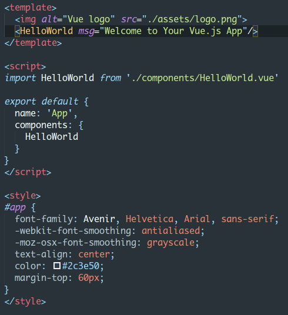
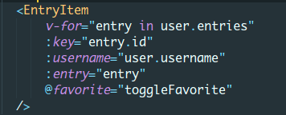
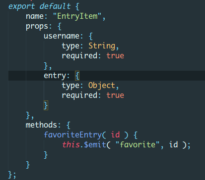
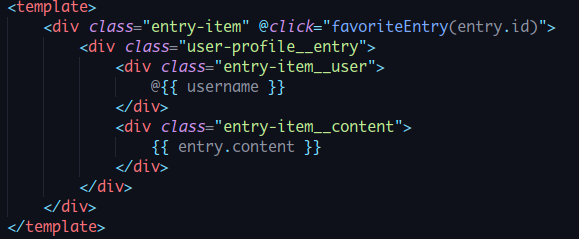

# Tutorial VueJS - Estructura de folders y archivos, para dummies

## Antes de empezar

Necesitamos instalado en nuestro equipo nodejs de preferencia la ultima version LTS (al dia de hoy, v12).
Una vez instaldo node temndremos disponible el comando npm que nos servirá para instalar las dependencias de nuestros proyectos.
Para crear una aplicación solo necesitamos instalar de forma global [vue cli](https://v3.vuejs.org/guide/installation.html#cli). En la misma página se pueden encontrar muchas ligas para diferentes formas de embeber vue en cualquier proyecto html.
```
npm install -g @vue/cli
```
## Creando una aplicación VueJS
Una vez que hayamos instalado vue cli procederemos a crear un proyecto, simplemente, vamos al folder donde queremos que se almacene dicho proyecto y tecleamos:
```
vue create <nombre aplicación>
```
Obviamente hay muchas formas de despellejar un gato, para más formas de crear una aplicación VueJS podemos echar un vistazo a la [documentación](https://cli.vuejs.org/)
Inmediatamente se creará un folder con todos los archivos necesarios para empezar a desarrollar una aplicación vue.
## Estructura de directorios
Vamos a ver una estructura como la siguiente:


Inicialmente contamos con 2 folders: _public_ y _src_. Vamos a describir la funcionalidad de cada uno de ellos:

### public
Dentro de éste folder vamos a tener todos los archivos estáticos que componen nuestra aplicación, como se ve en la imagen ya cuenta con un par de archivos **favicon.ico** e **index.html**, difilmente vamos a agregar otros archivos aqui, basicamente es el punto de entrada para nuestra aplicación.
##### favicon.ico
Éste es el icono que vemos a la izquierda del nombre de la página en el navegador
##### index.html
Éste archivo es el que contiene la etiqueta que nuestra aplicación vue va a buscar para cargar nuestra plantilla principal

### src
Dentro de este folder tendremos todos los archivos que van a definir nuestra aplicación, los componentes que nos ayudarán a construir bloques que nos ayudarán a tener diferentes elementos en nuestra aplicación con su propia lógica, estilo y funcionalidad.
Vemos en este folder tenemos dos sub-folders _assets_ y _components_, definiremos su funcion a continuación
##### _assets_
En este folder tendremos todos los archivos que nuestros componentes necesiten utilizar como se ve en el ejemplo, ya tenemos un archivo logo.png, podemos tener aquí una estructura de folders para almacenar cualquier cantidad de imagenes que necesitemos en nuestros componentes, así como cualquier otro archivo compartido podemos dejarlo en este folder para ser utilizado por nuestra aplicación (imagenes, hojas de estilo que sean común para los componentes, etc)

##### _components_
Como su nombre lo indica aquí vamos a almacenar las definiciones de los componentes de nuestra aplicación, no importa la subestructura que le demos a éste folder, los componentes serán referenciados siempre por medio de una ruta relativa al folder components.

## Que es un componente?
Un componente no es otra cosa más que un archivo con extensión vue, mismo que contiene un bloque de plantilla, seguido de un bloque script ya sea javascript o typescript y un bloque de estilo: 

Componente principal App.vue



Como podemos ver, tenemos las 3 partes que constituyen un componente:

1. Bloque de plantilla (HTML): `<template></template>`
2. Bloque de script (javascript/typescript): `<script></script>` y
3. Bloque de estilo: `<style></style>`

Cada uno de los bloques puede ser tan grande como sea necesario para el componente, la finalidad de éste tipo de enfoque es que cada parte de una pagina esté compuesta por varios componentes, definiremos a continuación cada uno de los bloques de un componente.

### - Bloque de plantilla (HTML)

Como vemos en el ejemplo, nuestra plantilla solo contiene 2 etiquetas `img>` y `<HelloWorld>`, ésta última, es un componente. Si vemos nuestra aplicación corriendo veremos:


Ésto nos dice que el componente HelloWorld tiene todas las ligas que vemos debajo del logo de VueJS.

Éste es un componente simple, para inyectar más complejidad al componente tenemmos varias opciones para agregar a nuestras etiquetas como parametros y dentro de `{{ }}` para mostrar valores de funciones o de variables que controlamos dentro de nuestro componente.

Más información acerca [aquí](https://v3.vuejs.org/guide/introduction.html#declarative-rendering)

### - Bloque de script

En el bloque de script solo tenemos la inclusión del componente HelloWorld (1) y definición de nuestro componente (2).
```
1 import HelloWorld from './components/HelloWorld.vue'

2 export default {
    name: App,
    components: {
        HelloWorld
    }
}
```
Dentro de la definición export default, tenemos 2 variables: `name` y `components`
- **name** Es el nombre con el cual vamos a llamar a la etiqueta que nos muestre la plantilla de éste componente
- **components** Son los componentes que vamos a utilizar en nuestra plantilla

Dentro de éste bloque, definiremos las funciones y procedimientos que nos ayudarán a dar más complejidad y funcionalidad a nuestro componente.

Más información acerca [aquí](https://v3.vuejs.org/guide/introduction.html#declarative-rendering)

Hay diferentes secciones en las que agregaremos las distintas partes que nos permiten lograr darle ésta complejidad al componente.

En el ejemplo anterior donde solo teníamos un par de variables, todo en este bloque se trata de objetos o variables, tenemos otras que son reservadas como son _data_, _computed_, _methods_ por mencionar algunas. Vamos a definir para que sirven y/o como se utilizan éstos objetos.

##### data
Éste objeto es en si, una función, en la cual vamos a devolver todos los objetos (variables, arreglos, etc) que utilizaremos en nuestra plantilla.

##### computed
En éste objeto vamos a definir las funciones que utilizaremos, funciones que regresan valores que se calculan al moento como el nombre deo objeto define

##### methods
Aquí definiremos las funciones que manipulan a nuestras variables y muestran los cambios en nuestra plantilla, en resumen, todo evento que haga cambios en las variables de nuestra plantilla debe ir en esta sección

##### watch
Para dar dinamismo a una aplicación es necesario que tengamos constante monitoreo de nuestas instancias o variables, para esto tenemos este apartado donde crearemos funciones que se activen cuando la variabel u objeto que estamos vigilando cambie, para agregar un evento solo necesitamos definir una función con el mismo nombre de la variable que queremos monitorear, dicha función recibirá 2 parametros, el primero es el valor actual del objeto y el segundo el valor anterior del mismo, depende de cada quien hacer las validaciones pertinentes para activar los cambios al DOM

##### props
En nuestros componentes vamos a recibir parametros a través de atributos como cualquier etiqueta html, dichos para metros se definen dentro de este objeto, debemos definir también el typo de dato que el objeto recibe y si es requerido o no.


### - Bloque de estilo

El bloque de estilo se explica por si mismo.

## Utilizando componentes
Como ya hemos visto, en VueJS cada archivo contiene un componente. En ésta sección vamos a familiarizarnos con la forma en que los componentes se llaman entre si y como se puede hacer el paso de datos entre los componentes.


Aquí tenemos un componente en uso, como podemos ver, es una etiqueta con algunos parámetros, unos ya conocidos y otros nuevos en cuanto a la notación.

Habíamos mencionado antes que VueJS tiene atributos especiales que nos ayudarán a construir elementos y a ocultarlos de ser necesario. En este ejemplo tenemos el atributo `v-for`, el cual nos ayuda a repetir esta misma etiqueta para todos los elementos de un arreglo o lista, debemos definir como referenciar cada uno de los elementos así como también que identificador daremos a cada etiqueta que repetiremos (`:key`).

Hay otros atributos que están presentes como `:username` y `:entry`,  éstos son atributos que el componente requiere para poder ser mostrado. También vemos otro atributo nuevo que parace un evento `@favorite` pero no es un evento de VueJS, este evento es creado por nosotros para establecer 'comunicación' entre los componentes.


En ésta imagen tenemos la definición de los atributos que se piden para nuestro componente, como vemos, tenemos el objeto `props` donde especificamos qué atributos son los que el componente puede recibir, el tipo y si son requeridos o no.

Hablabamos también del evento `favorite`, dentro de nuestro bloque `methods` tenemos una función, la cual será ejecutada cuando nosotros definamos.


Para ésta función en particular elegimos el evento `@click` cada vez que hagamos click en el elemento EntryItem, se ejecutará el evento favoriteEntry, va a recibir un parámetro el cual vamos a lanzar de vuelta al componente del cual fue llamada éste otro.

## Otros componentes de VueJS
Para una lista de otros componentes y ejemplos vea la [documentación](https://vuejsexamples.com/)
